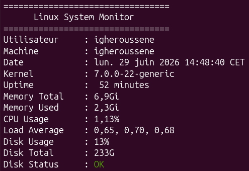

# Linux System Monitor



A lightweight Bash-based system monitoring tool for Linux.

## Overview

Linux System Monitor is a Bash-based command-line application that displays essential system information such as CPU usage, memory usage, disk usage, kernel version, uptime, and system load average.
This project was developed to improve Linux command-line skills, Bash scripting, and system monitoring techniques.

## Features

- Display system information
- Display CPU usage
- Display memory usage
- Display disk usage
- Display kernel version
- Display system uptime
- Display load average
- Colorized terminal output
- Command-line options

## Technologies

- Bash
- Linux
- awk
- grep
- printf
- mpstat
- Git

## Installation

Clone the repository:

```bash
git clone git@github.com:aghilesigheroussene/linux-system-monitor.git
```

Go to the project directory:

```bash
cd linux-system-monitor
```

Make the script executable:

```bash
chmod +x system_monitor.sh
```

## Usage

Run the application:

```bash
./system_monitor.sh
```

Available options:

```bash
./system_monitor.sh --all
./system_monitor.sh --system
./system_monitor.sh --cpu
./system_monitor.sh --memory
./system_monitor.sh --disk
./system_monitor.sh --version
./system_monitor.sh --help
```

## Project Structure

```
linux-system-monitor/
│
├── system_monitor.sh
├── README.md
├── LICENSE
├── .gitignore
└── screenshots/
```

## Skills Learned

- Bash scripting
- Linux command-line tools
- System monitoring
- Shell scripting best practices
- Git version control
- GitHub workflow
- Linux process monitoring

## Future Improvements

- Network monitoring
- Process monitoring
- CPU temperature
- Export reports to log files
- Interactive terminal interface

## License

This project is licensed under the MIT License.

## Author

**Aghiles IGHEROUSSENE**

Master's student in Embedded Systems Engineering.
Interested in Linux, Embedded AI, Computer Vision, and High-Performance Computing. 
